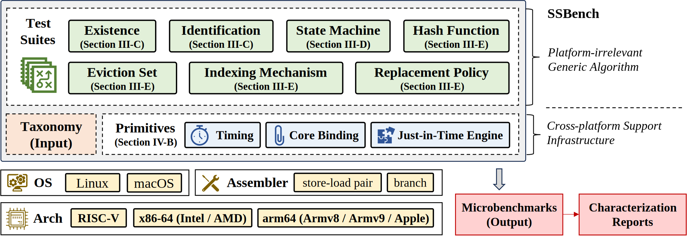

# SSBench

## Introduction

This repository contains SSBench, an automated framework for characterizing the design of Memory Dependence Predictors (MDPs) across different CPU architectures. SSBench systematically analyzes key aspects of MDPs, including:

- Existence and design type
- State machine
- Hash function
- Organization parameters  

An overview of SSBench is illustrated in the figure below (Figure 4 in the paper). The framework consists of multiple test suites, including existence test, design type test, state machine test, hash function test, eviction set test, indexing mechanism test and replacement policy test. Platform-independent algorithms are implemented in Python, while cross-platform support is provided through microbenchmark primitives such as timing, core binding, and a just-in-time execution engine.



### Repository Structure

```shell
.
├── build.sh                         # Script to set up the conda environment
├── environment.yml                  # Conda environment specification
├── data                             # Experimental results
│   └── example                      # Example results across different CPUs
├── lib                              # Test suite implementations (Python)
│   ├── exist.py                     # Existence and identification test
│   ├── hash.py                      # Hash function test
│   ├── org.py                       # Organization test (eviction, indexing, replacement)
│   ├── sm.py                        # State machine test
│   └── utils                        # Generic algorithms
│       ├── cluster.py               # DBSCAN-1D clustering
│       ├── hash_linear_solver.py    # Solve Rx = 0
│       └── sm_solver.py             # Linear programming solver
├── LICENSE
├── main.py                          # Entry point of SSBench
├── src                              # Microbenchmarks (C / Assembly)
│   ├── arch                         # Architecture-specific assembly
│   ├── config.h                     # Configuration parameters
│   ├── exist                        # Existence and identification test
│   ├── hash                         # Hash test
│   ├── org                          # Organization test
│   ├── sm                           # State machine test
│   ├── utils                        # Common C utilities
│   └── utils.h
└── tools                            # Platform-specific tools
    └── arm-pmu-enable               # PMU enable module for Arm
```

## Environment Setup and Build

### Intel and AMD CPUs

Install Miniconda:

```shell
curl -O https://repo.anaconda.com/miniconda/Miniconda3-latest-Linux-x86_64.sh
bash Miniconda3-latest-Linux-x86_64.sh 
```

Follow the installation instructions and initialize Conda.

Create the SSBench environment:

```shell
./build.sh
```

Activate the environment:

```shell
conda activate ssbench-env
```

### Arm CPUs

On Arm platforms, Performance Monitor Unit (PMU) access must be enabled in user space:

```shell
cd tools/arm-pmu-enable
sudo make
sudo insmod pmu_enable.ko
```

Install Miniconda:

```shell
curl -O https://repo.anaconda.com/miniconda/Miniconda3-latest-Linux-aarch64.sh
bash Miniconda3-latest-Linux-aarch64.sh
```

Follow the installation instructions and initialize Conda.

Create the SSBench environment:

```shell
./build.sh
```

Activate the environment:

```shell
conda activate ssbench-env
```

### Apple CPUs

On Apple CPUs, enabling PMU requires patching the macOS kernel.

Please refer to: https://github.com/jprx/PacmanPatcher

After patching, install Miniconda:

```shell
curl -O https://repo.anaconda.com/miniconda/Miniconda3-latest-MacOSX-arm64.sh
bash Miniconda3-latest-MacOSX-arm64.sh
```

Follow the installation instructions and initialize Conda.

Create the SSBench environment:

```shell
./build.sh
```

Activate the environment:

```shell
conda activate ssbench-env
```

## Run

Run SSBench with:

```shell
python3 main.py -c <core-id>
```

where `<core-id>` specifies the CPU core used for microbenchmark execution.

SSBench automatically detects the underlying architecture. Currently supported platforms include Intel, AMD, Arm (Cortex / Neoverse) and Apple Silicon. The architecture can also be specified manually:

```shell
python3 main.py -c <core-id> -a <arch>  # <arch> in ["intel", "amd", "arm", "apple", "neoverse"]
```

If root privileges are unavailable, use `-u` to avoid `sudo` requirement. 

Note: Without root access, physical address mapping may be inaccurate, which can affect hash function inference in some MDP designs.

### Output

The experimental results will be generated in `data/characterization.json`. Each MDP characterization is represented as a structured dictionary:

```shell
exist:
  <bool>
  # Whether an MDP is detected

type_time_dict:
  # Time intervals for different event types
  S: [[start_cycle, end_cycle], ...]   # Execution time in Bypass (S)
  B: [[start_cycle, end_cycle], ...]   # Execution time in Block (B)
  R: [[start_cycle, end_cycle], ...]   # Execution time in Rollback (R)

  # Boundary timestamps
  b1: <int>
  b2: <int>
  b3: <int>

state machine:
  # Store-side state machine
  store_exist: <bool>        # whether an SL type MDP exists
  store_sm: [int x 7]        # State machine in 1-counter model

  # Load-side state machine
  load_exist: <bool>         # whether an L type MDP exists
  load_sm: [int x 7]         # State machine in 1-counter model
  load_seq: <string>         # State setup for hash and org test

hash:
  # Hash function in matrix format
  hash_func: [[int, ...], ...]

  hash_va: <bool>            # Whether the input based on virtual address
  hash_seq: <string>         # State setup for hash test
  expected_sm_val: <int>     # Boundary state machine counter value

org:
  # Structural organization inference
  eviction_set_size: <int>           # Size of eviction set
  confidence_eviction_set_size: <float>

  size: <int>                       # Prediction table size
  set: <int>                        # Number of sets
  set_index: <int>                  # Index bits in binary format, 
  									# e.g., 7 means bits 0-2 are used for index
  replacement_policy: <string>      # in [lru, plru, nlru, fifo, unknown]

time:
  # Execution time per test stage (in seconds)
  exist: <float>    # existence test
  sm: <float>       # state machine test
  hash: <float>     # hash test
  org: <float>      # organization test
```

## Research Paper

For detailed methodology and evaluation, please refer to **SSBench: Automated Characterization of Memory Dependence Predictors on Modern CPUs**, which is accepted at the *International Symposium on Computer Architecture (ISCA 2026)*.

## License

This project is licensed under the Apache License 2.0.